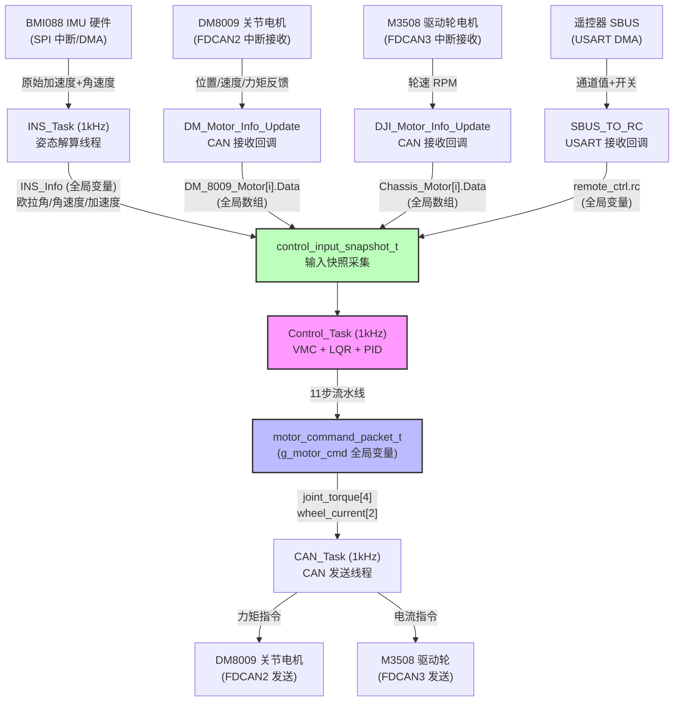
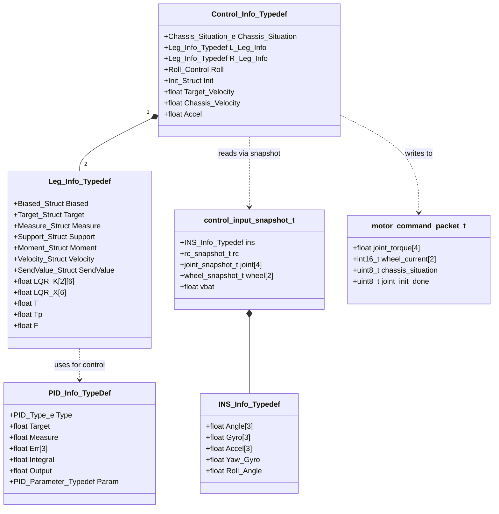

# 偏置并联轮腿机器人 —— 核心架构分析报告

> **项目**：`rm-biased-parallel-controller_KEIL`  
> **硬件平台**：STM32H723VGTx (Cortex-M7, 550MHz)  
> **RTOS**：FreeRTOS (CMSIS-OS v2 封装)  
> **控制对象**：偏置并联轮腿机器人（4× DM8009 关节电机 + 2× M3508 驱动轮电机 + BMI088 IMU）  

---

## 1. 核心架构总结

这套代码是**基于 STM32H7 + FreeRTOS 的偏置并联轮腿机器人实时控制系统**，主要功能是实现双轮腿机器人的自平衡、底盘移动（前进/后退/转向）、底盘高度切换以及横滚姿态补偿。系统层级可划分为四层：

| 层级 | 说明 | 关键文件 |
|------|------|---------|
| **BSP 硬件抽象层** | 对 STM32 HAL 库的二次封装，提供 CAN/SPI/UART/ADC/PWM 等外设的统一接口 | [`bsp_can.c`](BSP/Src/bsp_can.c), [`bsp_spi.c`](BSP/Src/bsp_spi.c), [`bsp_uart.c`](BSP/Src/bsp_uart.c), [`bsp_adc.c`](BSP/Src/bsp_adc.c) |
| **Device 设备驱动层** | 封装具体外设器件（DM8009/M3508 电机、BMI088 IMU、遥控器 SBUS 协议）的通信协议和数据解析逻辑 | [`Motor.c`](Components/Device/Src/Motor.c), [`Bmi088.c`](Components/Device/Src/Bmi088.c), [`Remote_Control.c`](Components/Device/Src/Remote_Control.c) |
| **Algorithm 算法组件层** | 提供 PID 控制器、低通滤波器、四元数 EKF、卡尔曼滤波、斜坡函数等可复用算法模块 | [`PID.c`](Components/Controller/Src/PID.c), [`Quaternion.c`](Components/Algorithm/Src/Quaternion.c), [`Kalman_Filter.c`](Components/Algorithm/Src/Kalman_Filter.c), [`LPF.c`](Components/Algorithm/Src/LPF.c) |
| **Task 调度与业务逻辑层** | FreeRTOS 多任务调度，包含 INS_Task（姿态解算 1kHz）、Control_Task（VMC+LQR控制 1kHz）、CAN_Task（CAN 通信 1kHz）、Detect_Task（异常检测 1kHz） | [`INS_Task.c`](Application/Task/Src/INS_Task.c), [`Control_Task.c`](Application/Task/Src/Control_Task.c), [`CAN_Task.c`](Application/Task/Src/CAN_Task.c), [`control_io.c`](Application/Task/Src/control_io.c) |

**核心控制策略**：采用 **VMC（虚拟模型控制）+ 增益调度 LQR** 的双层架构。VMC 层将偏置并联腿的复杂正运动学映射为"简化单级倒立摆"模型（虚拟腿长 L0 和虚拟摆角 φ0），LQR 层基于该简化模型计算平衡控制力矩（T, Tp），再通过雅可比逆矩阵将简化力/力矩映射回四个真实关节电机的力矩指令。

---

## 2. 数据流与控制流

### 2.1 以大喵电机（DM8009）控制指令为例的完整数据链路



### 2.2 Control_Task 内部 11 步流水线详解

```mermaid
flowchart LR
    subgraph "输入边界 (control_io.c)"
        S1["1. Control_InputSnapshot_Update\n采集全局硬件变量快照"]
    end
    
    subgraph "预处理阶段"
        S2["2. Check_Low_Voltage_Beep\n电池电压检测"]
        S3["3. Mode_Update\n底盘模式/平衡状态机"]
        S4["4. Joint_Angle_Offset\n关节角度→VMC坐标系映射"]
    end
    
    subgraph "VMC 正运动学"
        S5["5. VMC_Calculate\n连杆正运动学→简化腿长L0+摆角φ0"]
        S6["6. LQR_K_Update\n基于L0的增益调度\nK=f(L0³, L0², L0, 1)"]
    end
    
    subgraph "传感器融合与估计"
        S7["7. Measure_Update\nIMU+轮速计融合\n计算6维状态向量"]
    end
    
    subgraph "高层控制"
        S8["8. Chassis_Move_Control\n底盘速度+偏航PID"]
        S9["9. Chassis_Height_Control\n腿长切换"]
        S10["10. Chassis_Roll_Control\n横滚补偿"]
        S11["11. Leg_Length_Control\n腿长PID+重力补偿"]
    end
    
    subgraph "LQR 计算与力矩分配"
        S12["12. VMC_Measure_F_Tp_Calculate\n支撑力+离地检测"]
        S13["13. LQR_X_Update\n状态误差向量X"]
        S14["14. LQR_T_Tp_Calculate\nu = -K·X"]
        S15["15. Comprehensive_F_Calculate\n力矩综合+防劈叉PID"]
        S16["16. Joint_Tourgue_Calculate\n雅可比逆矩阵→真实关节力矩"]
    end
    
    subgraph "输出边界 (control_io.c)"
        S17["17. Control_OutputPacket_Generate\n打包 g_motor_cmd"]
    end
    
    S1 --> S2 --> S3 --> S4 --> S5 --> S6 --> S7 --> S8 --> S9 --> S10 --> S11 --> S12 --> S13 --> S14 --> S15 --> S16 --> S17
```



**关键数据传递方式**：任务间通过**全局变量（无锁）**进行数据共享：
- [`INS_Info`](Application/Task/Inc/INS_Task.h:26) ← INS_Task 写入，Control_Task 读出（通过快照拷贝）
- [`Control_Info`](Application/Task/Inc/Control_Task.h:419) ← Control_Task 写入，CAN_Task 读出
- [`g_motor_cmd`](Application/Task/Inc/control_io.h:93) ← `Control_OutputPacket_Generate()` 写入，CAN_Task 读出
- [`remote_ctrl`](Components/Device/Inc/Remote_Control.h:167) ← USART 中断写入，Control_Task/CAN_Task 读出
- [`DM_8009_Motor[]`](Components/Device/Inc/Motor.h:150) ← FDCAN 中断写入，Control_Task/CAN_Task 读出

---

## 3. 核心结构体分析

### 3.1 Top-5 核心结构体

#### ① [`Leg_Info_Typedef`](Application/Task/Inc/Control_Task.h:44) — 单腿完整信息

**职责**：封装一条腿（左或右）的所有物理参数、运动学中间变量、传感器测量值、控制力矩分量、速度融合状态和最终输出值。这是整个控制系统的**核心数据单元**。

**大小估算**：约 500+ 字节（含大量 float 成员），每个 `Control_Info_Typedef` 包含两份（左右腿），总计约 1KB+。

| 子结构 | 说明 |
|--------|------|
| `Biased` | 偏置并联腿的机械参数与关节实时状态（角度/角速度/力矩） |
| `Target` | 6维目标状态向量（LQR 参考值） |
| `Measure` | 6维测量状态向量（IMU+轮速计融合） |
| `Support` | 支撑腿检测（法向力 FN / 标志 Flag） |
| `Moment` | 各控制通道力矩分量（Balance_T, Balance_Tp, Turn_T, Roll_F, Leg_Length_F, Leg_Coordinate_Tp） |
| `Velocity` | 轮速→线速度→预测→融合四步速度估算链 |
| `SendValue` | 最终下发电机的执行值（关节力矩 + 驱动轮电流） |

#### ② [`Control_Info_Typedef`](Application/Task/Inc/Control_Task.h:260) — 全局控制状态

**职责**：整个控制系统的顶层状态容器，包含左右腿信息、底盘模式状态机、初始化标志位、横滚控制参数、偏航控制参数等。`Control_Task` 中几乎所有的 `static` 函数都以该结构体指针作为唯一参数，实现了**以结构体为中心的数据流**。

**关键成员**：
- `L_Leg_Info` / `R_Leg_Info`：左右腿完整信息
- `Chassis_Situation`：底盘状态（CHASSIS_WEAK / CHASSIS_BALANCE）
- `Init`：多层初始化状态机（关节初始化 → 平衡初始化 → 偏航初始化 → 速度初始化）
- `Roll`：横滚控制独立参数（腿长差、坡度正切等）
- `Target_Velocity` / `Chassis_Velocity` / `Accel`：底盘级状态

#### ③ [`control_input_snapshot_t`](Application/Task/Inc/control_io.h:50) — 输入快照

**职责**：**I/O 边界抽象**——每个控制周期开始时一次性采集所有硬件全局变量，后续 11 步控制流水线**只读此快照**，不再访问硬件全局变量。这是 `control_io.h` 解耦设计的核心。

```c
typedef struct {
    INS_Info_Typedef ins;       // IMU 姿态 (复制 44 字节)
    rc_snapshot_t rc;           // 遥控器 (10 字节)
    joint_snapshot_t joint[4];  // 4个关节电机 (4×16 字节)
    wheel_snapshot_t wheel[2];  // 2个驱动轮 (2×2 字节)
    float vbat;                 // 电池电压
    uint32_t tick;              // 时间戳
} control_input_snapshot_t;
```

**大小**：约 140 字节，在 1kHz 控制频率下栈上分配，无堆内存压力。

#### ④ [`motor_command_packet_t`](Application/Task/Inc/control_io.h:66) — 输出命令包

**职责**：控制算法输出与 CAN 通信输入之间的**解耦边界**。Control_Task 只填充此结构体，CAN_Task 只读取此结构体，两者不直接访问 `Control_Info` 中的 `SendValue`。

```c
typedef struct {
    float joint_torque[4];      // 关节目标力矩 [左小腿,左大腿,右大腿,右小腿]
    int16_t wheel_current[2];   // 驱动轮目标电流 [左,右]
    uint8_t chassis_situation;  // 底盘状态
    uint8_t joint_init_done;    // 初始化完成标志
    uint32_t seq;               // 递增序号
    uint32_t tick;              // 时间戳
} motor_command_packet_t;
```

#### ⑤ [`PID_Info_TypeDef`](Components/Controller/Inc/PID.h:91) — PID 控制器

**职责**：通用 PID 控制器结构体，采用**函数指针多态**设计（`PID_Param_Init`、`PID_Calc_Clear`），支持位置式/增量式两种模式，内置一阶微分低通滤波和错误处理。

**使用实例**（6个 PID 控制器共享此结构体）：
- `PID_Leg_length_F[2]`：左右腿长 PID
- `PID_Leg_Roll_F`：横滚补偿力 PID
- `PID_Leg_Coordinate`：防劈叉协调 PID
- `PID_Yaw[2]`：偏航串级 PID（位置环 + 速度环）

### 3.2 结构体依赖关系图



---

## 4. 潜在优化点（Code Review）

### 4.1 内存与数据一致性隐患

#### 🔴 P0: 全局变量无锁并发访问

多个任务之间通过原始全局变量（`INS_Info`、`Control_Info`、`remote_ctrl`）传递数据，**没有任何互斥锁或原子操作保护**。虽然 `control_input_snapshot_t` 的快照机制部分缓解了 Control_Task 对输入的竞争问题，但以下路径仍存在风险：

- [`CAN_Task.c:71-74`](Application/Task/Src/CAN_Task.c:71) 直接读取 `Control_Info.L_Leg_Info.SendValue.T_Calf` 等成员（而非通过 `g_motor_cmd`），绕过了 `control_io` 的隔离层。这意味着 Control_Task 写入 SendValue 与 CAN_Task 读取 SendValue **构成数据竞争**。
- `INS_Info` 被整个拷贝到 `control_input_snapshot_t.ins`（约 44 字节），在 Cortex-M7 上单次 `=` 赋值不保证原子性。

**建议**：
```c
// 方案A：CAN_Task 统一从 g_motor_cmd 读取（配合 control_io.h 设计意图）
DM_Motor_CAN_TxMessage(&FDCAN2_TxFrame, &DM_8009_Motor[0], 0, 0, 0, 0, g_motor_cmd.joint_torque[0]);

// 方案B：使用 FreeRTOS 消息队列替代全局变量
QueueHandle_t motor_cmd_queue;
xQueueOverwrite(motor_cmd_queue, &g_motor_cmd);  // CAN_Task 侧
xQueuePeek(motor_cmd_queue, &local_cmd, 0);       // Control_Task 侧
```

#### 🟡 P1: `Leg_Info_Typedef` 内存膨胀

单个 `Leg_Info_Typedef` 结构体包含大量只在特定函数中使用的中间变量（如 `a`, `b`, `M`, `N`, `S`, `S_Radicand`, `t`, `A`, `X_J_Dot`, `Y_J_Dot`），这些变量完全可以是栈上的局部变量，却被定义为结构体成员永久占用内存。

**建议**：将纯中间变量（`a`, `b`, `M`, `N`, `S`, `S_Radicand`, `t`, `A`）改为 `VMC_Calculate()` 函数的栈上局部变量，仅在结构体中保留跨周期需要的状态量（如 `Sip_Leg_Length`）。

#### 🟡 P2: 大量被注释掉的历史代码

[`Control_Task.c`](Application/Task/Src/Control_Task.c) 中有超过 150 行被注释掉的 LQR-K 参数矩阵（第 15-80 行 注释了 4 组完整的 K 矩阵），以及大量被注释的扭矩转换代码（第 1188-1212 行）。这不仅影响可读性，也增加了维护成本。

**建议**：将历史参数迁移到配置文件或单独的 `params_history.md` 文档中，使用 Git 历史追溯变更。

### 4.2 性能与算法瓶颈

#### 🟡 P3: LQR 增益矩阵逐元素计算

[`LQR_K_Update()`](Application/Task/Src/Control_Task.c:547) 中，对于左右腿各自的 2×6=12 个增益矩阵元素，每个元素都调用 3 次 `powf()` 进行浮点幂运算（共 2×12×3 = 72 次 `powf()`/周期）。`powf()` 在无 FPU 加速时非常慢，即使有 FPU，霍纳法则（Horner's Method）也能显著减少运算量。

**优化方案**：
```c
// 当前：每个元素 3 次 powf
K[0][0] = K11[1]*powf(L0,3) + K11[2]*powf(L0,2) + K11[3]*L0 + K11[4];

// 优化：霍纳法则
float L0_2 = L0 * L0;
float L0_3 = L0_2 * L0;
K[0][0] = K11[1]*L0_3 + K11[2]*L0_2 + K11[3]*L0 + K11[4];
```
或者更激进地，预计算 L0 的多项式值并查表：在腿长范围 [0.14, 0.32] 内做 10-20 个采样点的线性插值即可满足工程精度。

#### 🟡 P4: `Measure_Update()` 中重复计算

[`Measure_Update()`](Application/Task/Src/Control_Task.c:590) 中对左右腿重复执行几乎完全相同的 IMU 数据读取和速度融合计算。左右腿的 `Phi`、`Phi_dot` 使用相同的 IMU 值，但在结构体中各自存储了一份。

**建议**：IMU 相关计算提升到 `Control_Info` 顶层（而非按腿重复存储），减少冗余存储和计算。

#### 🟡 P5: `armsqrt_f32()` 除零风险

[`VMC_Calculate()`](Application/Task/Src/Control_Task.c:485) 中 `arm_sqrt_f32(S_Radicand, &S)` 后直接使用 `S` 做分母（第 489 行 `A = (a*t*sinM)/S`），没有对 `S` 做零值检查。当 `S_Radicand` 为负（理论上不应发生，但浮点舍入可能导致）或接近零时，会导致异常值传播。

**建议**：
```c
if (S < 1e-6f) S = 1e-6f;  // 或直接跳过本周期
```

### 4.3 架构解耦与可维护性

#### 🔴 P6: Control_Task 中包含硬件操作代码

尽管引入了 [`control_io.h`](Application/Task/Inc/control_io.h) 作为 I/O 边界，但当前版本的 `Control_Task.c` 中仍然保留了对硬件全局变量的直接访问：

- **注意**：对比 `architecture_refactor_plan.md` 中的旧版代码，当前 [`Control_Task.c`](Application/Task/Src/Control_Task.c) 已经通过 `control_input_snapshot_t` 和 `g_motor_cmd` 完成了 I/O 解耦——这是一个**重大进步**。但 CAN_Task 尚未完全对齐此设计（见 P0）。

#### 🟡 P7: 状态机逻辑与数学计算混杂

[`Mode_Update()`](Application/Task/Src/Control_Task.c:361) 中的初始化状态机逻辑和 [`Measure_Update()`](Application/Task/Src/Control_Task.c:590) 中的传感器融合逻辑与纯数学控制计算（VMC, LQR）混杂在同一个文件中，导致 [`Control_Task.c`](Application/Task/Src/Control_Task.c) 超过 1200 行。

**建议**：按职责拆分为多个模块：
- `mode_state_machine.c`：底盘状态机（Mode_Update, Check_Low_Voltage_Beep）
- `vmc_kinematics.c`：VMC 正运动学（Joint_Angle_Offset, VMC_Calculate, Joint_Tourgue_Calculate）
- `lqr_controller.c`：LQR 控制（LQR_K_Update, LQR_X_Update, LQR_T_Tp_Calculate）
- `chassis_control.c`：底盘高层控制（Move, Height, Roll, Leg_Length）
- `sensor_fusion.c`：传感器融合（Measure_Update）

#### 🟡 P8: `g_motor_cmd` 与 `Control_Info` 的语义重叠

`motor_command_packet_t` 中的 `chassis_situation` 和 `joint_init_done` 实际上是 `Control_Info` 的状态反射，存在重复拷贝。如果 CAN_Task 已经能直接访问 `Control_Info`（当前确实如此），这些冗余字段可以在 `g_motor_cmd` 中移除。反之，如果严格遵循 I/O 边界设计，则应让 CAN_Task**只**通过 `g_motor_cmd` 获取所有信息。

#### 🟢 P9: PID 控制器初始化参数使用魔法数字

[`Control_Task.c`](Application/Task/Src/Control_Task.c:104-117) 中 PID 参数定义使用裸 float 数组，缺乏语义化：

```c
static float PID_Leg_Length_F_Param[7] = {1300.f, 1.f, 60000.f, 0.f, 0.f, 10.f, 100.f};
//                                         KP      KI    KD      Alpha Deadband LimitI LimitOut
```

**建议**：使用 C99 指定初始化器或宏定义：
```c
#define PID_PARAM(Kp, Ki, Kd, Alpha, Deadband, LimitI, LimitO) \
    { (Kp), (Ki), (Kd), (Alpha), (Deadband), (LimitI), (LimitO) }

static float PID_Leg_Length_F_Param[7] = PID_PARAM(1300, 1, 60000, 0, 0, 10, 100);
```

#### 🟢 P10: 缺少 `static_assert` 检查结构体大小

`control_input_snapshot_t` 在每次控制循环（1kHz）都会被栈分配并拷贝。建议添加编译期断言确保其大小在预期范围内：
```c
_Static_assert(sizeof(control_input_snapshot_t) <= 256, "Snapshot too large for stack");
```

---

## 5. 总结评价

| 维度 | 评分 | 说明 |
|------|------|------|
| **控制算法深度** | ⭐⭐⭐⭐⭐ | VMC+LQR 双层架构、增益调度、支撑检测自适应——算法设计非常专业 |
| **模块化设计** | ⭐⭐⭐ | `control_io.h` 的 I/O 边界设计思路很好，但 CAN_Task 未完全对齐；单文件 1200+ 行过长 |
| **实时安全性** | ⭐⭐ | 无锁全局变量并发访问是最大的隐患；`arm_sqrt_f32` 无零值保护 |
| **代码整洁度** | ⭐⭐ | 大量注释掉的历史代码、魔法数字、重复注释（中英文混杂） |
| **可维护性** | ⭐⭐⭐ | 结构体自注释做得不错，但函数职责划分可以更清晰 |

**优先修复建议**：
1. 🔴 让 CAN_Task 统一通过 `g_motor_cmd` 获取电机指令（消除数据竞争）
2. 🔴 添加 `arm_sqrt_f32` 的零值/负值保护
3. 🟡 将 `VMC_Calculate` 中的中间变量改为栈局部变量
4. 🟡 `powf()` 替换为霍纳法则
5. 🟡 清理注释掉的历史代码
